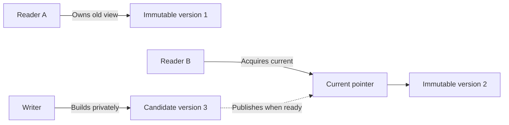

# Concurrent Read-Mostly Map

A compiled C++20 string-to-string map for applications that read shared data
frequently and change it occasionally: configuration, feature flags, or small
routing tables. Licensed under [MIT](LICENSE).

The central idea: **readers use a complete, unchanged version while a writer
prepares the next version separately.** The writer then changes which version
new readers receive. Existing readers keep their old view.



The writer prepares version 3 while new readers still receive version 2.
Reader A continues using version 1. No reader modifies a published table.

## Start here

New to concurrency? Read these in order:

1. [Documentation map](docs/README.md): choose a learning path.
2. [Concepts in plain English](docs/concepts.md): snapshot, transaction,
   publication, retention registry, telemetry, and ownership.
3. [Getting started](docs/getting-started.md): build and run your first program.
4. [Step-by-step tutorial](docs/tutorial.md): updates, conflicts, budgets,
   concurrent reads, and the experimental backend.

Experienced C++ users: start with the [API reference](docs/api-contract.md),
[architecture](docs/architecture.md), and [publication/memory ordering](docs/publication.md).
See [operations](docs/operations.md) for retention, metrics and shutdown, or
[integration](docs/integration.md) to link the installed package into your service.

## Build and run

Requirements: C++20 compiler, CMake 3.24 or newer, and Ninja for the presets.
The library depends on native threads and, on some toolchains, the system atomic
runtime detected by CMake. Python is optional for documentation/tool checks.
From the repository root:

```sh
cmake --preset debug
cmake --build --preset debug
ctest --preset debug
./build/debug/examples/config_reload_example
./build/debug/examples/routing_example
```

If Ninja is unavailable, use a fresh directory with CMake's default generator:

```sh
cmake -S . -B build/manual -DCMAKE_BUILD_TYPE=Debug
cmake --build build/manual
ctest --test-dir build/manual --output-on-failure
```

The [getting-started guide](docs/getting-started.md) includes a complete program,
expected output and installed-package instructions.

## What the library guarantees

- One acquired snapshot sees a consistent immutable table, including related keys.
- Readers do not acquire the application's writer mutex.
- Writers serialize the entire copy/build/publish operation, avoiding lost writes.
- Failed validation, allocation or admission does not partially change the published table.
- Owning snapshots keep their data alive across later writes and map destruction.
- Version-checked updates reject stale edits. Closing rejects writes, not reads.

The default backend uses atomic shared ownership. It does **not** promise
lock-free or wait-free reads: standard-library atomics/refcounts can use
internal synchronization, and final-owner destruction may run on a reader thread.
The [experimental hazard backend](docs/hazard-reclamation.md) offers reusable
registered guards with additional protocol and lifecycle restrictions.

## When it fits—and when it does not

Good fit: many lookups, rare updates, manageable tables, and requests that
benefit from one stable view. Updates copy the entire table, so a large,
write-heavy database is not a good fit. This is an in-memory library, not a
persistent database, network server, or full RCU implementation.

Hash lookup is average O(1), worst-case O(n). Transaction updates are average
O(n + k), where n is table size and k is the number of operations, plus string
copying and allocation. Whole-table replacement builds directly from its input
without copying the old table. Long-lived views retain old versions. Benchmark your workload;
the project makes no universal speedup claim.

## Status and further reading

Version 0.1 is pre-stable. The core library, budgets, telemetry, examples,
benchmarks, model tests and fuzzing are implemented. The hazard backend remains
experimental. [Testing](docs/testing.md) records local evidence, not independent
protocol approval. See the [release gates](docs/release-checklist.md) and
[compatibility policy](docs/compatibility.md).

- [Benchmark methodology and regression tools](benchmarks/README.md)
- [Coverage-guided fuzzing and replay](docs/fuzzing.md)
- [Troubleshooting and common mistakes](docs/troubleshooting.md)
- [Contributor and documentation workflow](docs/contributing.md)

## Repository layout

```text
include/read_mostly/  Small public .hpp declarations
src/                 Compiled .cpp implementation and private helpers
examples/            Runnable config reload and exact-path routing examples
tests/               Unit, failure-injection, concurrent, model and replay tests
benchmarks/          Workload comparisons and snapshot-cost experiments
tools/               Performance, package and documentation checks
docs/                Beginner guides, API reference and engineering contracts
.github/workflows/   Compiler/sanitizer checks, fuzzing and nightly stress
```

Most implementation lives in `.cpp` files. Public `.hpp` files declare the API;
consumers link the compiled `read_mostly::map` CMake target. The roadmap is
intentionally local and is not published.
