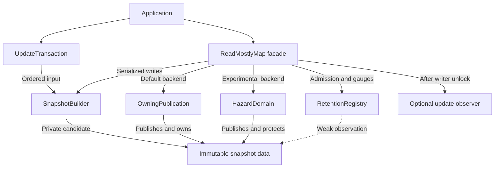

# Architecture and source-code tour

[Documentation home](README.md) · Prerequisite: [Concepts](concepts.md)

## 1. Public API versus implementation

The public headers declare concrete types, mostly using opaque implementation
storage. Consumers include these `.hpp` files and link the compiled library.
Private headers and `.cpp` files implement containers, locking, publication and
reclamation. This limits exposure of internal layout; it is not an ABI guarantee.

The core table is `string → string`, backed by an immutable `unordered_map`.
Domain-specific meaning, parsing, validation, networking and persistence stay
outside the core. The [routing example](../examples/routing_table.cpp) illustrates
this boundary; it is exact-path routing, not a prefix-routing engine.

## 2. Component relationships

These are in-process modules, not services or network calls. The facade selects
one publication backend. Both use the same builder and retention admission.
The optional observer sees write outcomes after the writer mutex is unlocked.
The weak retention edge is deliberately different from data ownership.

| Component | Owns or manages | Does not do |
|---|---|---|
| `ReadMostlyMap` | Backend, writer mutex, closed state, options and counters | Parse application configuration |
| `Snapshot` | Shared immutable data handle | Modify its published table |
| `UpdateTransaction` | Ordered owned operations | Publish automatically |
| `SnapshotBuilder` | Private candidate during a build | Change its source or input batch |
| `OwningPublication` | Atomic shared ownership of current wrapper | Serialize writers by itself |
| `HazardDomain` | Current wrapper, retired wrappers, weak slot list | Provide a background collector |
| `HazardReader` / `HazardGuard` | Registration / scoped protection | Permit two active guards on one slot |
| `RetentionRegistry` | Weak lifetime records and logical admission | Enforce physical heap caps |
| Update observer | Caller-defined notification | Run serialized with other callbacks |

## 3. Read path: default backend

`ReadMostlyMap::acquire_snapshot()` delegates to `OwningPublication::acquire()`.
The atomic load safely retains a `shared_ptr<const Snapshot>` wrapper. While
that wrapper is alive, its data handle is copied into the returned `Snapshot`.
The temporary wrapper ownership then ends. The result independently owns data.

Lookups through the result read immutable storage. A lookup does not construct
a new key from `string_view`; transparent hashing supports heterogeneous lookup.
`find_copy` additionally creates an owning string result and may allocate.

There are two reference-count layers: the publication wrapper and table data.
This adds ownership traffic, but keeps read visibility and lifetime coupled.
The default read does not scan retention records or collect telemetry.

## 4. Write path: both backends

The facade's writer mutex protects current-state decisions and the entire build.
It checks `closed`, then expected version, builds a candidate, checks live
admission and publishes. Candidate limits are handled by the builder; live-version
limits by the retention registry. Exception paths retain the old publication.

After the result or exception is recorded, the writer mutex is released before
the observer executes. Another writer may publish before that callback runs;
callbacks can therefore arrive out of version order.

`replace_all` builds an empty candidate directly from the supplied entries,
without copying the old table or constructing an intermediate transaction.
It still copies input strings and uses the same validation and publication rules.

## 5. Experimental read and collection paths

Registered hazard readers use a slot to protect a raw wrapper pointer, then
validate that the current head still matches before dereferencing it. A guard
holds the slot; the slot holds the domain; the domain keeps only weak slot
references. This avoids a reference cycle while letting guards outlive the facade.

Writers collect previously retired wrappers before publication, then preallocate
bookkeeping and retire the old head after the atomic exchange. Statistics and
drain also collect. There is no background reclamation thread. See the
[protocol and ordering argument](hazard-reclamation.md).

## 6. Design principles applied here

- **Single responsibility:** edit recording, candidate building, publication,
  admission and domain adaptation are distinct components.
- **Encapsulation:** published data is immutable; storage/layout helpers are private.
- **Composition:** the facade composes the selected backend, builder and policies.
- **Explicit lifetime ownership:** snapshots/guards own the mechanism that keeps
  their data usable; the map owner must join facade callers before destruction.
- **Failure atomicity:** potentially failing preparation occurs before publication.
- **Measured optimization:** the portable backend is the reference; advanced
  reclamation is opt-in and does not imply a universal speedup.

No inheritance hierarchy or virtual dispatch is added to the library just to
name a pattern. The concrete API intentionally focuses on one table domain.

## 7. Performance boundaries

| Operation | Main cost |
|---|---|
| `Snapshot::find` | Average O(1) hash lookup; worst-case O(n); hash/compare key bytes |
| Copy snapshot | Shared ownership bookkeeping, not full table copy |
| Commit with k operations | Average O(n + k), plus string copies, validation and allocations |
| `replace_all` | Input assignments and final-table validation; no old-table copy |
| Default acquisition | Atomic wrapper ownership plus data ownership copy |
| Hazard registration | Allocation and slot-registry mutex |
| Guard acquisition | SC atomics, slot ownership; may retry under publication |
| Hazard collection | Up to O(retired wrappers × registered slots) |
| Statistics | Writer lock, optional registry sweep and hazard collection |

Big-O does not account for allocator latency, scheduling, hash collisions or
cache contention. Releasing the final owner may destroy a table on a reader
thread. There is no hard real-time or whole-library lock-free guarantee.

## 8. Where to read the code

| File | Start here to understand |
|---|---|
| [read_mostly_map.hpp](../include/read_mostly/read_mostly_map.hpp) | Public map contract |
| [read_mostly_map.cpp](../src/read_mostly_map.cpp) | Writer coordination, status precedence, management |
| [snapshot_data.hpp](../src/snapshot_data.hpp) | Private table layout and transparent hashing |
| [update_transaction.cpp](../src/update_transaction.cpp) | Owned edit recording and move/copy behavior |
| [snapshot_builder.cpp](../src/snapshot_builder.cpp) | Copy/apply/limits and version increment |
| [owning_publication.hpp](../src/owning_publication.hpp) | Default atomic shared ownership |
| [retention_registry.cpp](../src/retention_registry.cpp) | Weak tracking, budgets and gauges |
| [hazard_domain.cpp](../src/hazard_domain.cpp) | Protect/revalidate, retirement and scan |
| [hazard_reader.cpp](../src/hazard_reader.cpp) | Guard lifetime and same-slot exclusion |

Read [publication](publication.md) next for temporal behavior, or
[API reference](api-contract.md) for exact usage rules.
