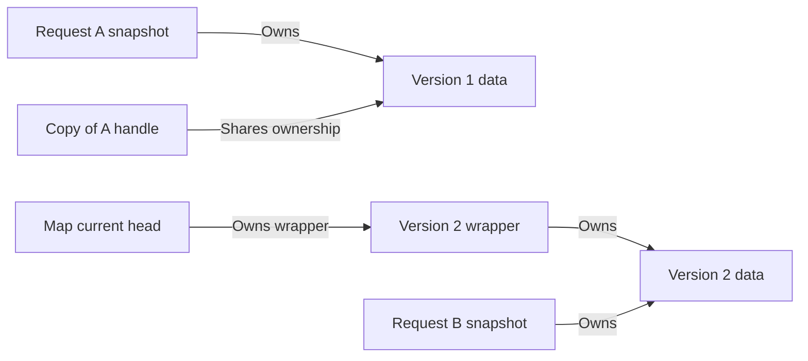
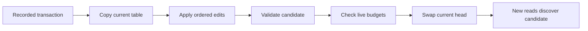

# Concepts in plain English

[Documentation home](README.md) · Next: [Getting started](getting-started.md)

## 1. The problem: readers should not see half an update

Imagine two checkout settings:

```text
checkout.enabled = false
checkout.endpoint = stable
```

An administrator enables checkout and switches it to `canary`. Changing shared
entries in place while requests read them could produce a mixed pair:
`enabled=true` with `endpoint=stable`. Locking reads and writes prevents that,
but introduces synchronization on the mutable table.

This library publishes **whole table versions**. A request acquires one version
and uses it for both lookups. Other requests may use newer versions; each
individual request still gets a consistent pair.

## 2. Snapshot: a handle to one stable version

Think of a snapshot as a book edition. A new edition does not change the pages
of the edition already on your desk.

`Snapshot` is a small owning handle, not a full table copy on every read.
Its internal `shared_ptr` owns immutable data. Copying a handle shares that
data. New published versions get separate table data.



Both A handles keep version 1 data alive. The map and B refer to version 2.
Destroying one A handle does not free version 1 while the other still exists.
The wrapper is a small publication object, not another copy of the table.

A snapshot does not automatically refresh. Acquire a new one to see another
publication. A version number identifies a successful update; it is not a
timestamp or a count of readers.

## 3. Transaction: an ordered list of edits

`UpdateTransaction` records “assign,” “erase,” or “clear” operations. Recording
does not change the live map. This fragment records three edits:

```cpp
read_mostly::UpdateTransaction edits;
edits.insert_or_assign("mode", "safe");
edits.erase("mode");
edits.insert_or_assign("mode", "fast");
```

After commit, `mode` is `fast`: operations execute in order. Transactions own
their strings, have independent copies, and can be reused. This is not a disk
database transaction with durability or arbitrary transactional reads. Atomicity
means that a batch's whole resulting table is published together.

## 4. Copy-on-write: prepare new data away from readers

On a write, `SnapshotBuilder` copies the current table, applies edits, checks
limits and creates the next version. This is private. A failed build leaves
readers using the unchanged published version.

The writer mutex covers the entire read/copy/build/publish cycle. Otherwise,
two writers could start from the same old version and one could erase the
other's changes. Serializing writers prevents that lost-update problem.
Readers do not acquire this writer mutex.

## 5. Publication: make a complete version discoverable

Publication is the instant the current pointer changes to the replacement.
It does not change existing snapshots.



Validation and admission may fail before the swap. Readers racing publication
may receive the old or new version, but never a partly built candidate.

## 6. Retention: an old version is still needed

“Retired” means **no longer current**, not “already destroyed.” An old version
stays alive while an owning handle or experimental guard needs it. This prevents
use-after-free: accessing memory after it was deleted.

Reclamation frees objects once nobody needs them. The default backend uses
shared ownership. The hazard backend scans protection slots before freeing
retired wrappers. Long-running requests or snapshot caches can retain memory;
that is a lifetime trade-off, not automatically a leak.

## 7. Retention registry: a weak inventory, not a garbage collector

The optional registry records which **published data versions** remain alive,
their logical key/value payload, and publication times. Weak pointers observe
lifetimes without keeping table data alive.

Writers use the inventory for live-version admission; statistics expose current
and retired data. The registry does not track every heap allocation or delete
owning snapshots. Hazard protection slots form a separate registry used for
reclamation. See [operations](operations.md).

## 8. Telemetry: information about behavior

Telemetry means counters, timings, gauges and optional update notifications:
successful commits, conflicts, retained payload and elapsed update time. It is
not the configuration data itself.

Write counters and retention tracking are separate options. Reads do not update
these counters. `statistics()` locks the writer mutex and is a management
operation; do not call it for every lookup.

## Vocabulary at a glance

| Term | Meaning in this project |
|---|---|
| Snapshot | Owning handle to immutable table data at one version |
| Transaction | Owned, ordered list of edits |
| Builder | Private copy/apply/validate implementation |
| Publication | Atomic change of the map's current head |
| Retired version | Previously published version that is no longer current |
| Retention registry | Weak inventory for published data and admission |
| Reclamation | Freeing obsolete objects after their users finish |
| Telemetry | Optional write metrics, lifetime gauges and update events |
| Hazard reader | Reusable registration with one protection slot |
| Hazard guard | Scoped protection of one snapshot wrapper |

Visibility and lifetime differ: memory ordering makes initialized data visible;
ownership or protection makes it safe to keep using it. The
[publication guide](publication.md) explains both.
