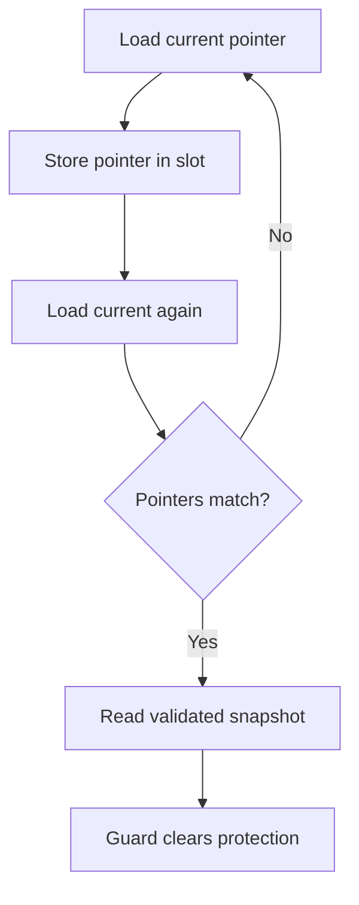
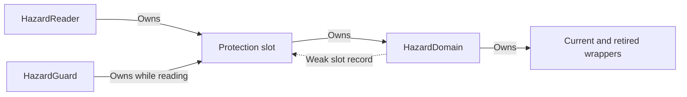

# Experimental hazard-pointer backend

[Documentation home](README.md) · Prerequisites: [Publication](publication.md), [Tutorial](tutorial.md)

Start with shared ownership unless measurements justify this extra complexity.
“Hazard” means a public announcement that a reader may still access a particular
wrapper address. A writer must not reclaim that retired wrapper while a slot
protects it. This registry is separate from the payload retention registry.

The default shared-ownership implementation remains the safe starting point.
This opt-in backend targets repeated guarded reads without incrementing the
globally shared snapshot reference count. It uses a custom C++20 protocol,
not the standard-library C++26 hazard-pointer API. Background:
[WG21 P2530R3](https://www.open-std.org/jtc1/sc22/wg21/docs/papers/2023/p2530r3.pdf)
describes protection and deferred reclamation and includes a read-mostly example.

API fragment inside a program; for a complete executable see the
[tutorial guard example](tutorial.md):

```cpp
read_mostly::MapOptions options;
options.backend = read_mostly::PublicationBackend::experimental_hazard;
options.track_retained_snapshots = true;
read_mostly::ReadMostlyMap map({}, options);
auto reader = map.register_reader(); // Register once per independent reader.
{
    auto guard = reader.acquire();
    const auto* value = guard.find("mode"); // Borrow only during this guard.
}
```

## Protection protocol and ordering argument



The first pointer is never dereferenced before validation. If publication changes
the head during acquisition, the loop retries. The guard clears protection after
its final access. A matching second load returns the freshly validated pointer,
which matters when memory addresses are reused.

The reader uses sequentially consistent pointer atomics:

1. Load current pointer A.
2. Store A in its hazard slot H.
3. Load current again V; retry if the address differs.
4. Only after successful validation, dereference the freshly validated pointer.
5. Clear the hazard after all data access ends.

The writer fully constructs a candidate, preallocates retirement bookkeeping,
checks admission, then exchanges current using sequential consistency. It
retires the previous wrapper without deleting it. A later collection scans
hazards using SC loads and frees only unprotected retired wrappers.

For an old object to be dereferenced, validation V must precede replacement W
in the total SC order. Program order gives H before V, and collection gives W
before scan S. Therefore H < V < W < S: an active hazard must be visible to
that scan. If W occurs before V, validation sees a different current pointer
and the reader retries without dereferencing the old object. If a guard clears
before the scan, its data access is already finished.

When a freed address is reused, validation returns the fresh pointer from its
second load, not the initial potentially stale pointer. The hazard protects that
address before validation; a currently retired wrapper cannot share the address
of another simultaneously live wrapper. Guard moves preserve the same slot,
so protection does not migrate across independently scanned slots.

The SC schedule test enumerates reader/writer event orders and checks the
active-guard invariant. It is a simplified ordering model, not a full C++
memory-model verifier. Stress, sanitizer, and code review supplement this
argument; they do not prove all possible executions or production readiness.
Independent protocol review remains open. Local Clang TSan now passes all
applicable groups, including three repeated runs. GitHub CI for `9e99cd7` also
passed GCC and Clang TSan jobs. These results do not replace independent protocol
review. See [verification](testing.md) for exclusions and the newer local-only
documentation checks.

## Registration and lifetime



There is no strong ownership cycle: the domain's slot reference is weak.
Destroying the reader does not invalidate an existing guard. After the map is
destroyed, remaining registrations keep the domain alive. This does not permit
concurrent calls on a facade being destroyed.

Registration allocates a slot and updates a weak slot list under a mutex.
Existing readers acquire guards without registration, allocation, or that
mutex. One active guard is allowed per reader; same-reader nesting/concurrent
acquisition throws logic_error. Independent registrations allow nested guards.
Moved-from readers/guards reject use. Guards and readers must not be moved
or destroyed concurrently with methods on that same object.

Each slot owns its domain, and the domain holds weak references to slots,
avoiding a cycle. A guard owns its slot even if its reader object is destroyed.
Readers/guards can outlive the map; its current and pending retired wrappers
then remain in the domain until the final registration/guard is released.
Threads calling map methods must still finish before map destruction.

copy_snapshot converts a protected view into owning immutable data and may
outlive the guard. This conversion increments the snapshot data reference count.
Compatibility acquire_snapshot/find_copy calls use an ephemeral registration
and are deliberately more expensive; use registered guards for the fast path.

## Progress, admission, and reclamation

The backend rejects construction/registration if required pointer/boolean
atomics are not lock-free. Guard acquisition may retry indefinitely under
continuous publication; it is not wait-free. Per-slot shared ownership and
the underlying standard library are not given a blanket lock-free guarantee.
Writers still serialize, registration/collection use a mutex, and the entire
library is not lock-free.

Collection runs before a hazard publication and on statistics/drain operations.
It may scan all registered slots for each retired wrapper: O(retired * slots).
No background reclamation thread runs. Released guards clear protection, but
pending wrappers are reclaimed at the next management/write collection or at
domain destruction. Releasing a guard normally only clears protection. If it
also releases the final domain owner after map destruction, that thread destroys
the domain and pending data. Owning conversions may likewise cause final data
destruction on their releasing thread. No bounded destruction-latency claim is made.

Existing live-payload/snapshot-count admission covers both guarded retired
versions and owning snapshot conversions. Budgets remain logical payload
limits, not total heap caps; candidates allocate before admission. A delayed
guard can cause memory_budget_exceeded until release and collection.
statistics additionally reports hazard_backend and hazard_retired_wrappers.
Timed close/drain semantics remain unchanged, and drain never invalidates guards.

Benchmark mode hazard registers one reader per worker outside timing and uses
one guard per batch. Longer controlled runs and validation are needed before
considering promotion beyond the explicitly experimental option.
