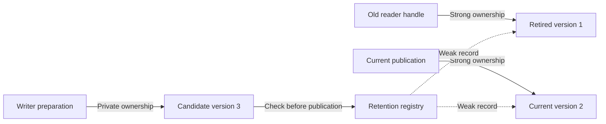

# Budgets, telemetry, and management operations

[Documentation home](README.md) · Prerequisite: [Tutorial](tutorial.md)

This guide is for the control plane: the code that reloads configuration,
reports diagnostics and shuts down a service. Request handlers should normally
acquire one view and perform lookups, not query statistics on every request.

ReadMostlyMap accepts SnapshotLimits plus MapOptions. Defaults disable
retention tracking, counters, timing, and callbacks. Normal reads have no
telemetry counters or registry accesses.
For the experimental hazard backend, guard registration and reclamation have
separate costs documented in hazard-reclamation.md.

Configuration fragment (inside your program, with the map API included):

```cpp
read_mostly::MapOptions options;
options.max_live_payload_bytes = 4 * 1024 * 1024;
options.max_live_snapshots = 64;
options.collect_update_metrics = true;
read_mostly::ReadMostlyMap config({}, options);
auto status = config.statistics();
```

## Writer admission

### Current, retained and candidate versions



Old and current published data already count toward admission. The writer checks
whether the candidate fits alongside them, then records it before publication.
Weak records do not keep table data alive. The candidate is not visible to readers
until publication succeeds. A copied handle to v1 is another owner of the same
data version, not a second retained snapshot in the count.

Finite budgets automatically enable weak tracking of actual snapshot storage,
not publication wrappers. Snapshot copies count until their last owner exits.
Expired records are swept on admissions, statistics calls, and drains.

The budget includes all live published versions plus the candidate, including
the old current snapshot owned during publication. Provision at least two
payloads/slots for ordinary replacement. Snapshot-count limits also bound
zero-payload versions. Zero slots is invalid.

Exceeding a budget returns memory_budget_exceeded/current version and preserves
the map. Writers may retry after obsolete handles are released. There is no
automatic wait/retry; closed and conflict checks take precedence.

Payload counts key/value characters, not all allocations. Candidate construction,
transaction strings, hash nodes, capacities, weak control blocks, registry
capacity, and allocator metadata are outside this budget. Candidates are built
before admission. This is a logical limit, not a hard heap cap; no portable
total-allocation estimate is exposed. Concurrent reader release can make sampled
gauges/admission conservative.

### A small budget example

Suppose each version has 100 logical payload bytes and `max_live_snapshots=2`.

| Situation at admission | Versions that must coexist | Outcome |
|---|---|---|
| Current v1; no older handles | v1 + candidate v2 | Two slots: admitted |
| Reader holds v1; current v2 | v1 + v2 + candidate v3 | Three slots: rejected |
| Reader releases v1; current v2 | v2 + candidate v3 | Two slots: admitted |

A payload budget of 150 bytes would reject even the first 100-byte replacement,
because old current and candidate require 200 logical bytes during publication.
The empty initial v0 still occupies a count slot even though its payload is zero.
The [tutorial budget program](tutorial.md) demonstrates release and retry.

## Statistics and observers

### Which fields are meaningful?

| Field group | Fields | Enablement and interpretation |
|---|---|---|
| Current state | `current_version`, `current_payload_bytes`, `closed` | Always reported |
| Backend | `hazard_backend`, `hazard_retired_wrappers` | Wrapper backlog for hazard mode; distinct from data-version gauges |
| Retention flags | `retention_tracking_enabled` | True if explicitly tracking or any live budget is finite |
| Live gauges | `live_snapshots`, `live_payload_bytes` | Current plus still-alive retired published data |
| Retired gauges | `retired_snapshots`, `retired_payload_bytes` | Live published data excluding current |
| Oldest retired | `oldest_retired_version`, `oldest_retired_age_nanoseconds` | Optional version; age since publication, not since retirement |
| Write flags | `update_metrics_enabled` | Controlled by `collect_update_metrics` |
| Write counters | `attempts`, `commits`, `conflicts`, `closed_rejections`, `budget_rejections`, `exceptions` | Saturate rather than wrap; no read counters |
| Update timing | `total_update_nanoseconds`, `max_update_nanoseconds` | Writer wait plus update work, excluding observer time |

Disabled gauge/counter fields being zero does not mean no retained versions or
no writes exist. Check the enablement flags first. Measurements can be conservative
because readers may release ownership while the management sample is taken.

### Optional observer example

This complete program counts successful update events without sharing unsynchronized
callback state. The context is created before—and destroyed after—the map.

```cpp
// runnable: update_observer
#include <read_mostly/read_mostly_map.hpp>
#include <atomic>
#include <iostream>

void on_update(const read_mostly::UpdateEvent& event, void* context) noexcept {
    if (event.outcome == read_mostly::UpdateOutcome::committed) {
        static_cast<std::atomic<unsigned>*>(context)->fetch_add(1, std::memory_order_relaxed);
    }
}

int main() {
    std::atomic<unsigned> notifications{0};
    read_mostly::MapOptions options;
    options.collect_update_metrics = true;
    options.observer = on_update;
    options.observer_context = &notifications;
    read_mostly::ReadMostlyMap map({}, options);
    read_mostly::UpdateTransaction batch;
    batch.insert_or_assign("mode", "fast");
    if (map.commit(batch).status != read_mostly::CommitStatus::committed) return 1;
    const auto stats = map.statistics();
    if (stats.attempts != 1 || stats.commits != 1 || notifications.load() != 1) return 1;
    std::cout << "attempts=1 commits=1 observer_events=1\n";
}
```

Output: `attempts=1 commits=1 observer_events=1`. Relaxed ordering is sufficient
for this independent counter; it is not being used to publish configuration data.

statistics locks the writer mutex and is a control-plane operation. Optional
saturating counters cover attempts, commits, conflicts, closed/budget rejections,
exceptions, total/max update time. Timings include writer-lock wait and exclude
callback execution. Mutex-acquisition failures are not counted as attempts.
Reads never increment these counters.

Retention gauges require retention_tracking_enabled. They report live/retired
counts, payload, oldest retired version, and its age since publication (not
time since retirement). Weak records do not retain data but can retain control
blocks until a sweep.

UpdateObserver is a noexcept function pointer plus caller-owned context.
It receives a result/exception event after unlocking and may inspect snapshots
or statistics. Callbacks can run concurrently and out of version order. They
must be thread-safe and non-blocking, must not destroy the map or recursively
submit writes, and their context must outlive map calls. Throwing from the
noexcept callback terminates the process.

## Close and drain

close_until polls writer try_lock until a steady-clock deadline, sleeping at
most 1ms between attempts. It does
not interrupt commits. False leaves state unchanged; true closes idempotently.
Reads remain available.

drain_retired_until requires a closed map and retention tracking. It waits for
older versions to lose strong ownership, excluding current-version handles.
Indefinitely held old handles cause false at the deadline; they stay valid.
Management-thread polling uses at most 1ms intervals, with no read-side polling.
Deadlines are best-effort wait bounds, not hard real-time guarantees.
False does not reopen the map. Join all map-method callers before destruction.

### Safe shutdown sequence

1. Stop accepting new application work and arrange for workers to finish.
2. Call close (or successfully time-close) if you want further writes rejected.
3. Join all threads that call map methods. Close itself does not join them.
4. Optionally release old handles and drain retired data on a closed, tracked map.
5. Destroy the facade. Independently owned snapshots may remain usable afterward.

If drain times out, it does not force-free data or invalidate readers. Find who
holds the old handles/guards and release them deliberately. Current-version
handles are excluded from drain. A past deadline may still succeed if the lock
can be acquired immediately; these APIs bound waiting, not hard real-time execution.
