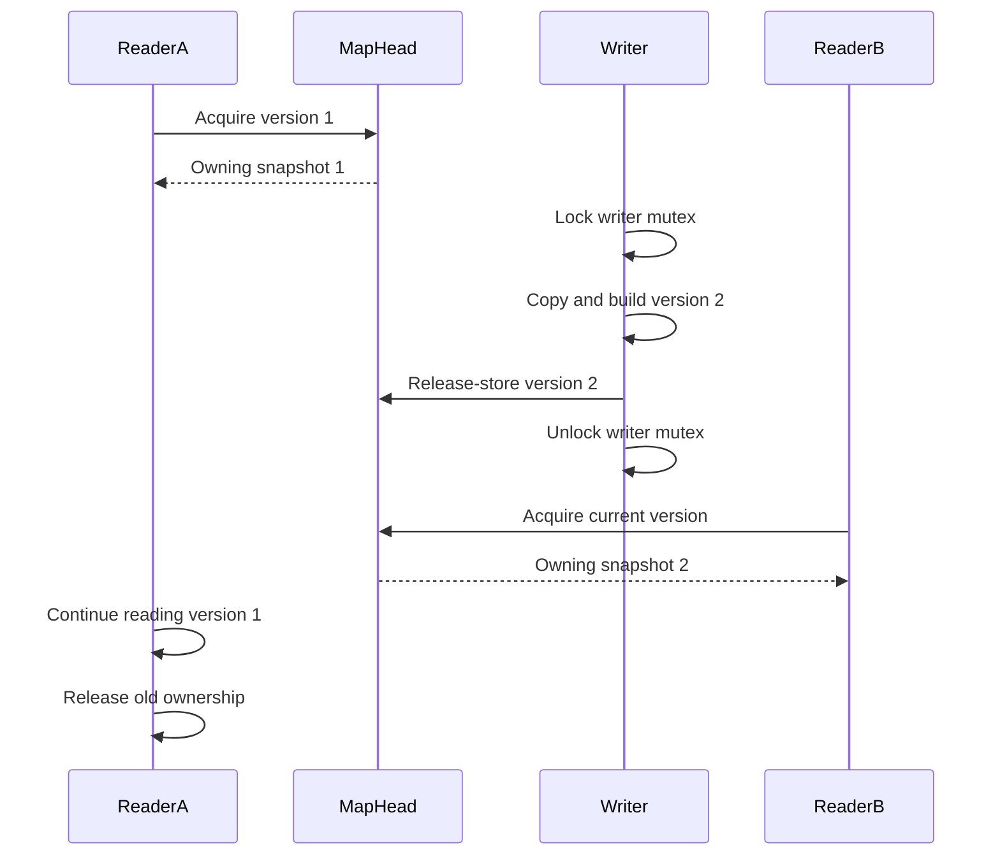
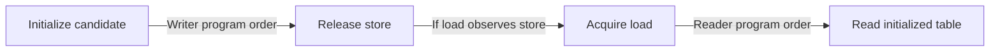
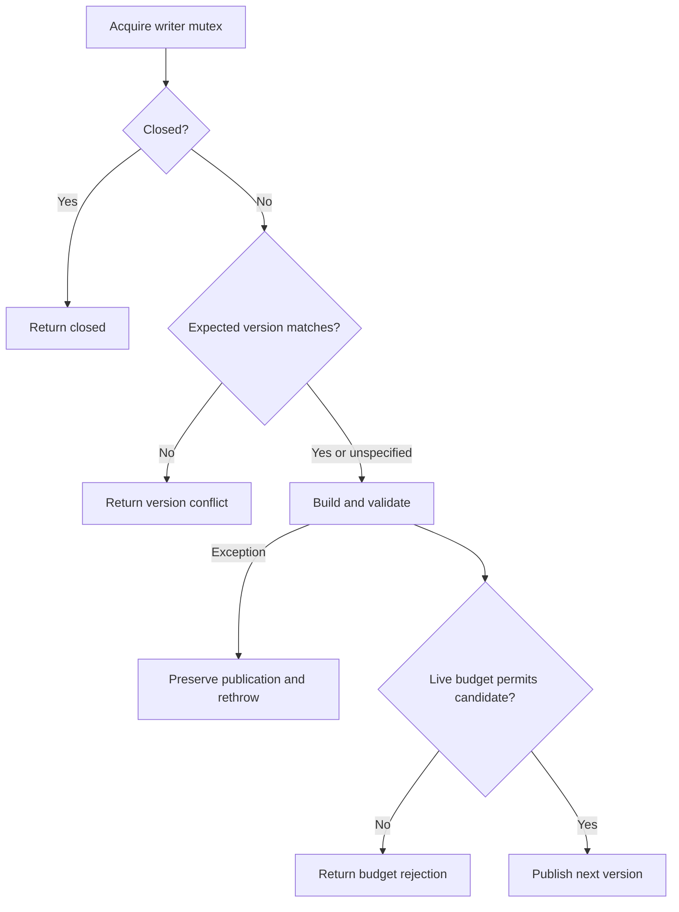

# Publication, memory ordering and lifetime

[Documentation home](README.md) · Prerequisites: [Concepts](concepts.md), [Architecture](architecture.md)

This guide describes the **default owning backend** unless stated otherwise.
The [hazard guide](hazard-reclamation.md) describes its different SC protocol.

## 1. What happens when a writer publishes?



This is one possible schedule. B observes version 2 because its load is after
the publication in this schedule. A does not refresh: its ownership keeps version
1 data alive. If a reader races the store, its acquisition may select either
whole version. A newly acquired view is not a promise that no writer publishes
again immediately afterward.

## 2. Visibility and lifetime are separate requirements

An atomic pointer swap prevents readers from seeing a torn pointer. That alone
does not solve either partially visible initialization or later deletion.

| Requirement | Default-backend mechanism |
|---|---|
| Do not race on mutable table data | Build privately; publish immutable data |
| See completed initialization after observing the new head | Release store paired with acquire load |
| Keep selected data alive during lookup | Atomic shared-pointer acquisition, then owning data handle |
| Avoid losing another writer's update | Mutex around the whole write cycle |

Memory ordering answers “which writes can this reader observe?” Ownership
answers “can this object still exist when the reader uses it?” Neither substitutes
for the other.

## 3. Release and acquire, step by step

The implementation has this shape (pseudocode; types and lifetime layers simplified):

```cpp
// Writer: candidate is fully initialized before publication.
current.store(candidate, std::memory_order_release);
// Reader: acquisition observes initialization if it observes that publication.
auto selected = current.load(std::memory_order_acquire);
```



Initialization occurs before the store in the writer. An acquire load observing
that release publication synchronizes with it. Initialization consequently
happens-before the reader's later table access. “Happens-before” is a C++ ordering
relationship, not a claim that processors physically execute every instruction
in one global sequence. Atomics implement the required visibility relationship.
The [C++ working draft's atomic ordering section](https://eel.is/c++draft/atomics.order)
defines the release/acquire synchronization rule used in this explanation.

Replacing these operations with relaxed atomics would remove this initialization
ordering guarantee. Making a raw pointer `volatile` would not provide the required
publication or ownership protocol. Do not weaken orderings without a new proof.

## 4. Why an atomic raw pointer is not enough

An unsafe design could do:

```text
reader: load old pointer
writer: replace pointer; delete old table
reader: dereference old pointer -> use-after-free
```

An acquire load does not prevent deletion. The default backend atomically takes
shared wrapper ownership during load, before replacement can release the last
owner out from under it. It then copies the wrapper's owning data handle while
the wrapper is alive. The returned snapshot independently keeps table data alive.

That is why a read can safely continue across later writes or map destruction.
The caller must still keep the snapshot alive while using a borrowed lookup result.

## 5. Why writers still use a mutex

Without write serialization, A and B might both copy v1. A adds one key and
publishes v2; B publishes its separately edited copy of v1 and loses A's key.
Atomic stores alone cannot merge independently prepared versions.

Here, A completes publication before B loads the source for its own build.
B therefore starts from A's latest publication. Version checking is optional
stale-decision detection on top of this serialized update mechanism.

## 6. The complete decision path



All outcomes release the writer lock; counters are recorded under the lock and
optional observer callbacks run after it is unlocked. Closed takes precedence
over conflict. Closed/conflict rejections skip candidate construction. Live
budget rejection occurs after the candidate was built and allocated.

Any successful update increments the version, even if the contents are equal
or the transaction is empty. Returned success refers to that committed version;
another writer may have advanced the map before the caller's next acquisition.

## 7. Linearization points

Linearization means identifying the instant an operation takes effect relative
to concurrent operations, rather than pretending a long method is instantaneous.

- Default successful update: the atomic release store of the replacement.
- Default snapshot acquisition: the atomic acquire load selecting a wrapper.
- Closed/conflict rejection: the relevant check under the writer mutex.
- Budget rejection: the failed admission decision under the writer mutex.
- Close: marking the map closed while holding the writer mutex.
- Hazard publication: the SC current-pointer exchange; guarded reads follow
  that backend's protect/revalidate argument.

The version number is consistent with the selected publication, not with some
later call on the facade. Convenience methods each acquire their own view.

## 8. Progress and shutdown boundaries

Readers do not acquire the application writer mutex. That does not prove lock-free
reads: atomic `shared_ptr` and reference counts may use internal synchronization.
Hash lookup, allocation in `find_copy`, and final-owner destruction also have
costs. No bounded-latency or wait-free guarantee is made.

`close()` waits for a current writer, marks the map closed, and rejects future
writes. Reads remain available; existing snapshots remain valid. Close does not
signal application threads to exit and does not wait for every snapshot to die.
Join all threads using map methods before destroying the facade. Owning snapshot
copies may outlive it. See [operations](operations.md) for timed close and drain.
